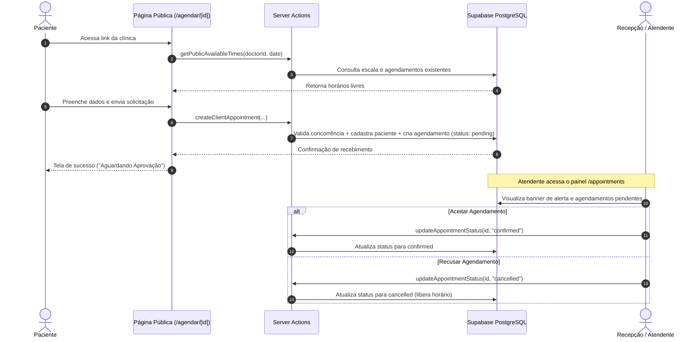

# 📅 Agendamento Online Público & Fluxo de Aprovação da Recepção

Este documento detalha a arquitetura, regras de negócio, padrões de segurança e boas práticas implementadas no sistema de **Agendamento Online para Clientes com Aprovação da Recepção**.

---

## 🎯 1. Visão Geral

A funcionalidade permite que cada clínica possua uma página pública e personalizada (`/agendar/[clinicId]`). Nela, os pacientes podem:
1. Visualizar os profissionais médicos da clínica e suas especialidades.
2. Escolher a data e o horário disponível em tempo real, respeitando a escala do médico e bloqueando horários ocupados.
3. Informar seus dados de contato (Nome, WhatsApp, E-mail, Sexo).
4. Enviar a solicitação de agendamento que entra no sistema com o status **`pending` (Pendente)**.

No painel administrativo, o atendente ou recepcionista da clínica recebe um alerta visual e pode:
- **Aceitar (Confirmar)**: Altera o status para `confirmed`.
- **Recusar (Cancelar)**: Altera o status para `cancelled` e libera o horário imediatamente na agenda do médico.

---

## 🔄 2. Fluxo da Operação



---

## 🛡️ 3. Boas Práticas e Segurança Implementadas

### 🔒 Isolamento Multitenant (Segurança de Dados da Clínica)
- Cada link público é vinculado exclusivamente ao UUID da clínica (`clinicId`).
- As consultas públicas validam que o médico selecionado realmente pertence àquela clínica específica:
  ```ts
  where: and(
    eq(doctorsTable.id, parsedInput.doctorId),
    eq(doctorsTable.clinicId, parsedInput.clinicId)
  )
  ```
- No painel administrativo, a action `updateAppointmentStatus` valida se o agendamento pertence à clínica do usuário logado antes de permitir qualquer modificação.

### ⚡ Prevenção contra Concorrência (*Race Conditions*)
- Além da checagem de horários disponíveis no formulário, a Server Action executa uma **verificação atômica no banco de dados imediatamente antes de persistir o agendamento**:
  ```ts
  const existingConflict = await db.query.appointmentsTable.findFirst({
    where: and(
      eq(appointmentsTable.doctorId, parsedInput.doctorId),
      eq(appointmentsTable.date, appointmentDateTime),
      ne(appointmentsTable.status, "cancelled"),
    ),
  });
  ```
  Isso impede que dois pacientes no mesmo segundo reservem a mesma vaga.

### 🛡️ Privacidade e Conformidade com LGPD / GDPR
- A rota pública `getPublicAvailableTimes` retorna apenas identificadores de horário e disponibilidade booleana (`available: true/false`).
- **Nenhum dado pessoal** de outros pacientes (nomes, e-mails, telefones ou histórico) é trafegado para o cliente público.

### 🧼 Validação Estrita e Sanitização de Entradas (Zod)
- Validação de formato para UUIDs, regex de datas (`YYYY-MM-DD`), e-mails válidos e comprimento mínimo de telefone.
- Higienização automática dos dados com `.trim()` e normalização de e-mail para caixa baixa (`.toLowerCase()`).

### 🚦 Gerenciamento de Rotas no Proxy
- No arquivo `src/proxy.ts`, as rotas sob `/agendar/*` foram adicionadas à lista de rotas públicas.
- Todas as rotas de gerenciamento (`/dashboard`, `/appointments`, `/doctors`, `/patients`, etc.) continuam protegidas por sessão obrigatória com Better Auth.

---

## 📂 4. Arquivos e Estrutura

| Arquivo | Descrição |
| :--- | :--- |
| `src/db/schema.ts` | Adicionado campo `status: text("status", { enum: ["pending", "confirmed", "cancelled"] })` |
| `src/proxy.ts` | Configuração para permitir acesso anônimo à rota pública `/agendar` |
| `src/actions/get-public-available-times/index.ts` | Action pública para consulta de horários disponíveis do médico |
| `src/actions/create-client-appointment/index.ts` | Action pública com validação de concorrência e criação com status pendente |
| `src/actions/update-appointment-status/index.ts` | Action autenticada para o atendente aprovar ou rejeitar solicitações |
| `src/actions/get-available-times/index.ts` | Atualizado para desconsiderar agendamentos cancelados |
| `src/actions/add-appointment/index.ts` | Atualizado para atribuir status `confirmed` em agendamentos internos |
| `src/app/agendar/[clinicId]/page.tsx` | Página pública de agendamento online com SSR e SEO otimizado |
| `src/app/agendar/[clinicId]/_components/booking-form.tsx` | Formulário interativo em etapas (Médico > Data/Hora > Dados > Confirmação) |
| `src/app/(protected)/appointments/page.tsx` | Página interna com listagem ordenada |
| `src/app/(protected)/appointments/_components/appointments-view.tsx` | Visualização administrativa com filtros, contadores e botão de copiar link |
| `src/app/(protected)/appointments/_components/table-columns.tsx` | Badges de status e contatos dos pacientes |
| `src/app/(protected)/appointments/_components/table-action.tsx` | Botões de Aceitar/Recusar e disparo de notificação no WhatsApp |
| `src/app/agendar/[clinicId]/status/[appointmentId]/page.tsx` | Página de acompanhamento de status em tempo real para o paciente |

---

## 💡 5. Como Operar no Dia a Dia

1. **Compartilhar o Link da Clínica:**
   - Acesse o menu **Agendamentos** no painel administrativo.
   - No topo da página, clique no botão **"Copiar Link"**.
   - Envie o link gerado para seus pacientes via WhatsApp, Instagram ou inclua em seu site.
2. **Revisar e Aprovar Agendamentos:**
   - Ao receber novos agendamentos online, um banner de alerta amarelo surgirá no topo informando quantas solicitações estão pendentes.
   - Clique em **"Ver Pendentes"** ou filtre pela aba **Pendentes**.
   - Clique em **"Aceitar"** para confirmar o paciente ou **"Recusar"** para cancelar e liberar o horário.
3. **Notificar o Paciente com 1 Clique (WhatsApp):**
   - Ao aceitar o agendamento (ou no botão verde **"WhatsApp"** da tabela), um clique abre o WhatsApp Web / App com a mensagem pré-formatada:
     - Dados da clínica, médico, especialidade, data e horário.
     - Link exclusivo de acompanhamento do status para o paciente.
4. **Consulta de Status pelo Paciente:**
   - Na tela de sucesso do agendamento, o paciente pode clicar em **"Acompanhar Status da Consulta"** ou salvar o link.
   - Caso o paciente já tenha agendado anteriormente, ele pode clicar em **"Já agendou? Consultar status"** no topo da página de agendamento e informar o código da consulta.
